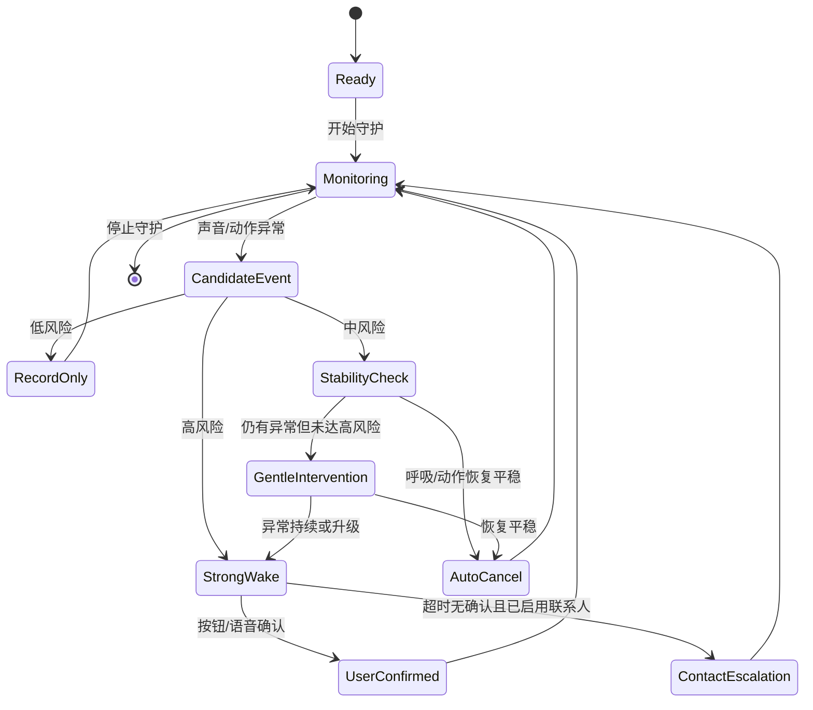

# 睡了么离线 MVP 功能规划

目标版本：Android-first MVP

核心约束：

- 不注册。
- 不收费。
- 不接服务器。
- 默认本地处理。
- 不做诊断、不下医学结论。
- 可以基于用户输入和夜间异常记录给出非诊断建议。

## 1. 产品原则

睡了么不是健康社区，也不是医疗诊断工具。它应像一个“床头安全守护器”：打开就能用，夜里只在必要时干预，早晨给用户看清楚发生了什么，以及今晚可以尝试哪些调整。

产品默认不要求用户理解复杂指标。用户只需要完成三件事，且都可以跳过：

1. 告诉 App 自己大致的睡眠状况。
2. 选择哪些情况要唤醒、哪些情况只记录。
3. 睡前点一下“开始守护”。

## 2. 首次引导流程

引导设置必须尽量简单。目标是：

- 10 秒内可跳过，直接使用默认标准模式。
- 60 秒内完成基础设置。
- 3 分钟内完成包含紧急联系人、蓝牙音箱、亲人录音的完整设置。
- 全程不要求注册、手机号、实名、服务器授权。
- 所有问题都可跳过，跳过后使用安全默认值。

### 2.0 快速路径

首次打开先给两个大按钮：

- 直接开始：使用标准模式，不配置联系人和录音。
- 简单设置：3 步完成常用设置。

“直接开始”进入首页并显示睡前检查；如果麦克风/通知缺失，再按需请求权限。

“简单设置”只问三组问题：

1. 你最担心什么？
   - 打鼾/喘息
   - 噩梦惊醒
   - 夜里动作大
   - 先用默认

2. 哪些情况要叫醒你？
   - 只在高风险叫醒
   - 高风险叫醒，鼾声先轻提醒
   - 尽量少打扰，只记录为主

3. 要不要设置紧急联系人？
   - 现在设置
   - 以后再说

其他设置都放进首页后的设置页。

### 2.1 欢迎和边界说明

首屏只讲三句话：

- 本 App 在手机本地识别夜间异常声音和动作。
- 可按你的设置进行轻提醒、强唤醒、电话或短信紧急通知。
- 它不提供医学诊断；如异常频繁，建议带记录咨询医生。

按钮：

- 直接开始
- 简单设置

“直接开始”很重要，保证开箱即用。用户跳过问卷也能直接进入守护。

### 2.2 隐私设置

默认选项：

- 本地处理：开启，不能关闭。
- 保存整夜录音：关闭，不提供默认入口。
- 保存异常片段：开启，可关闭。
- 异常片段长度：前 15 秒 + 后 30 秒。
- 数据加密：开启。
- 一键删除：设置页固定展示。

用户看到的是简单文案：

“睡了么默认不保存整夜录音，只保存异常前后的短片段，方便你早晨复盘。你也可以关闭片段保存，只保留事件时间线。”

### 2.3 睡眠状况输入

所有问题都允许跳过。用途是调整提醒敏感度和建议，不用于诊断。首次引导只问最少问题，详细信息放到设置页。

首次引导只问：

- 你最担心什么：打鼾/喘息、噩梦惊醒、夜里动作大、先用默认。
- 睡眠环境：一个人睡、同床/同房、有明显环境噪声、先跳过。
- 手机大概放哪里：床头、枕边、床垫旁、先跳过。

详细设置页再提供：

- 平时是否打鼾。
- 是否有人说你睡觉会憋气、喘息或呛咳。
- 是否常做噩梦或夜里惊醒。
- 是否有梦话、磨牙、咳嗽。
- 是否入睡困难或夜醒多。
- 是否使用手表/手环记录心率或血氧：是 / 否
- 是否希望异常频繁时提示“建议咨询医生”：是 / 否

注意：这里不问过细病史，不要求实名，不收用户本人手机号。紧急联系人电话在后面单独设置，且只保存在本机。

### 2.4 唤醒策略向导

首次引导只给用户三个预设，不展示复杂表格：

- 标准模式：高风险强唤醒，中风险先轻提醒，普通鼾声只记录。
- 安静模式：尽量不打扰，只对尖叫、疑似喘息/憋气、强动作唤醒。
- 敏感模式：噩梦、严重鼾声、反复咳嗽也会先轻提醒。

用户进入设置页并选择“自定义策略”后，才展示策略矩阵：

| 情况 | 默认动作 | 自动取消 | 可选动作 |
| --- | --- | --- | --- |
| 尖叫、惊恐喊声 | 立即强唤醒 | 否 | 强唤醒 / 先轻提醒 |
| 疑似静默后喘息/呛咳 | 强唤醒 | 谨慎取消 | 强唤醒 / 先轻提醒 / 只记录 |
| 连续高强度鼾声 | 先轻提醒 | 是 | 只记录 / 轻提醒 / 强唤醒 |
| 疑似噩梦声音 + 动作突增 | 先轻提醒 | 是 | 只记录 / 轻提醒 / 强唤醒 |
| 强烈翻动或撞击 | 先轻提醒 | 是 | 只记录 / 轻提醒 / 强唤醒 |
| 咳嗽频繁 | 只记录 | 是 | 只记录 / 轻提醒 |
| 磨牙 | 只记录 | 是 | 只记录 / 轻提醒 |
| 普通梦话 | 只记录 | 是 | 只记录 |
| 环境噪声 | 忽略 | 是 | 忽略 / 记录 |

### 2.5 语音停止设置

默认支持：

- “我没事”
- “停止唤醒”
- “熊熊停止”

设计规则：

- 只在唤醒响铃期间监听停止词，平时不做持续语音识别。
- 停止词必须本地识别。
- 识别成功后，App 仍展示“已停止，本次是否误报？”的大按钮。
- 如果用户没有语音停止，也可以按屏幕大按钮、音量键组合或电源键确认。

语音停止不建议做复杂声纹。MVP 只做“短语触发 + 风险复查”：如果用户说了停止词，且当前没有持续高风险信号，就停止唤醒；如果仍有疑似高风险信号，则降低音量询问一次，继续等待确认。

### 2.6 睡前测试

首次引导最后必须跑一个 20 秒测试：

- 麦克风权限是否可用。
- 前台服务是否可用。
- 通知和闹钟音量是否可用。
- 蓝牙音箱是否连接、可播放、音量是否足够。
- 如果已开启紧急通知：电话权限、短信权限、联系人号码格式是否可用。
- 勿扰模式下能否响铃。
- 手机是否建议充电。
- 环境底噪是否过高。

测试结束给出一句话：

“今晚可以使用。建议把手机放在床头 30-80 厘米范围内，并保持充电。”

如果用户连接了蓝牙音箱，测试结束还应提示：

“已检测到蓝牙音箱。今晚强唤醒会优先使用音箱；如果音箱断开，会自动回退到手机扬声器和震动。”

## 3. 主界面

主界面只保留睡前真正需要的东西：

- 大按钮：开始守护 / 停止守护。
- 晨间入口：我醒了 / 早安护理。
- 当前模式：标准 / 安静 / 敏感。
- 今日检查：麦克风、通知、音量、电量、充电、勿扰例外。
- 输出设备：手机扬声器 / 蓝牙音箱。
- 昨晚摘要：睡了多久、异常几次、唤醒几次、建议几条。
- 快捷入口：唤醒策略、异常记录、设置。

不要做复杂首页信息流。用户晚上打开时要能立刻开始。

## 3.1 睡眠开关和起床判断

手机很难单独、可靠判断“用户已经睡着”或“用户已经醒来”。产品不能把这个能力说成医学级识别。更稳妥的设计是三层：

- 主动开关：用户准备睡觉时点击“开始守护”，这是最可信的会话起点。
- 行为推断：如果用户没有手动开始，但夜间长时间静置、环境变暗、手机充电、动作减少，可提醒“是否开始守护”。这个提醒默认静音，只在睡前时段出现。
- 早晨确认：白天检测到可能起床的声音、拿起手机、解锁或用户点击“我醒了”后，温和问候并询问是否结束守护。

原则：

- 夜间不为了确认状态反复发声。
- 早晨问候可以有声音，但默认音量轻柔，且用户可关闭。
- “可能起床”只触发问候和确认，不直接下结论。
- 用户确认醒来后，才进入晨间护理和报告。
- 当前 APK 已加入清晨低打扰确认：守护超过约 4.5 小时后，只在 05:30-11:00 且检测到明显动作或守护超过约 7 小时时，发一条静音“早安，醒了吗？”通知。用户点开才结束守护并进入晨间护理；不点开则继续静音守护。

## 3.2 晨间护理

用户醒来后，App 从守护工具切换成“贴心小护理”：

- 问候：早安，昨晚辛苦了。
- 睡眠汇报：昨晚记录、强唤醒、自动取消、守护完整性、可信度。
- 喝水提醒：建议先喝水，可关闭。
- 吃药提醒：用户设置后才启用，可确认“已吃药”或“稍后提醒”。
- 晨练建议：简单拉伸、深呼吸、晒太阳，不做医疗处方。
- 天气小贴士：默认离线只提示“出门前查看天气”；用户开启联网后可接入天气。

吃药提醒规则：

- 默认关闭，必须用户主动设置。
- 只保存药名/备注和提醒时间在本机。
- 用户点击“已吃药”后当天不再提醒。
- 如果没有确认，按用户设置的间隔再次提醒，例如 15/30/60 分钟。
- 文案不替代医生医嘱，只提醒用户自己设定的事项。
- 当前 APK 支持两种入口：用户手动点击“我醒了，早安护理”，或清晨低打扰通知点开确认。自动起床判断仍只作为“可能醒来”的提醒，不直接下结论。

## 3.3 大模型陪伴助手

大模型适合做“复盘、建议、聊天、情绪陪伴”，不适合做夜间紧急判断的唯一依据。

默认策略：

- 夜间实时守护默认离线，不依赖大模型。
- 大模型入口默认关闭，用户可手动开启。
- 默认只发送结构化摘要，不上传整夜录音。
- 用户明确同意后，才可发送异常片段。
- 大模型建议必须标注“非诊断建议”。

助手能力：

- 解读睡眠报告。
- 根据用户反馈生成睡眠改善建议。
- 早晨问候和生活提醒。
- 聊天陪伴，缓解孤独和焦虑。
- 健康、生活、饮食、运动常识咨询。
- 提醒用户咨询医生，而不是替代医生诊断。

角色形象：

- 小女孩：漂亮、可爱、活泼、温柔。
- 小男孩：聪明、孝顺、可爱。
- 男青年：帅气、阳光、温柔。
- 女青年：漂亮、阳光、温柔、贴心。

UI 方向：少文字、面对面聊天、大头像、大按钮、语音优先。

## 4. 夜间工作流

守护运行本身必须静音。不能通过周期性提示音证明 App 仍在内存中运行，因为这会影响睡眠。正确证明方式是：

- 首页显示“正在守护”。
- 前台服务定期写入本地心跳，首页和睡前自检显示最近活跃状态。
- 系统通知栏保留静音常驻通知。
- 睡前自检提示电池优化状态，必要时引导用户允许不受电池优化限制。
- 首页和睡前自检显示守护完整性评分，避免把不完整记录误认为可靠结论。
- 首页显示检测可信度说明，明确当前版本不是医疗级识别，并显示本机个人基线学习状态。
- 早晨报告显示守护是否完整。
- 睡前测试确认权限、电量、音量、蓝牙音箱和紧急联系人。

只有检测到用户设置中需要干预的异常事件时，才允许轻提醒、震动、强唤醒或联系人升级。

### 4.1 状态机

### 4.2 采样和保存

采样：

- 音频：低采样率 PCM，分帧计算音量、频谱、周期性、事件类型。
- 动作：加速度计/陀螺仪，低频采样，识别翻身、突发动作、手机位置变化。
- 可穿戴：如果用户授权 Health Connect 或蓝牙设备，再读取心率、血氧、呼吸率。没有就不影响使用。

保存：

- 不保存整夜原始音频。
- 保存事件时间、类型、置信度、动作、触发依据。
- 如果用户允许，保存异常片段。
- 自动取消的事件也保存，因为它能帮助用户理解“App 干预了但没有吵醒你”。

## 5. 离线睡眠分析数据

这个软件主要在无网络场景下使用，所以睡眠分析必须完全依赖手机本地数据。核心思路是：少存原始敏感数据，多存结构化指标；短期用于昨晚复盘，长期用于个人基线和趋势建议。

### 5.1 数据分层

第一层：实时特征，随用随丢。

- 音频短窗口音量、频谱、周期性、静默时长。
- 动作短窗口强度、翻身、突发动作。
- 当前风险分数、事件候选状态。
- 这层数据只在内存或环形缓冲里，用于实时判断，不长期保存。

第二层：事件记录，长期保存。

- 鼾声、喘息/呛咳、咳嗽、尖叫、梦话、磨牙、强动作。
- 每个事件的开始/结束时间、持续时长、置信度、触发依据。
- 是否轻提醒、是否强唤醒、是否自动取消、用户是否确认。
- 用户早晨反馈：真实、误报、不确定。

第三层：每晚汇总，长期保存。

- 守护开始/结束时间。
- 估算入睡时间、可能醒来时段、整晚静稳时长。
- 异常总次数、高风险次数、自动取消次数、强唤醒次数。
- 鼾声总时长、最长连续鼾声、鼾声高发时间段。
- 咳嗽次数、疑似喘息/呛咳次数、噩梦/惊恐事件次数。
- 动作活跃指数、翻身/强动作次数。
- 手机放置、是否充电、音频输出设备、权限是否完整。
- 如果有可穿戴授权：夜间心率、血氧、呼吸率的本地摘要。

第四层：趋势指标，按需计算或缓存。

- 7 天、30 天、90 天趋势。
- 个人夜间底噪基线。
- 个人鼾声基线。
- 个人动作基线。
- 高风险事件重复模式。
- 误报率和建议的敏感度调整。

### 5.2 本地分析能力

无网络也要能生成这些分析：

- 昨晚报告：时间线、事件类型、唤醒动作、自动取消、建议。
- 7 天趋势：异常是否增加、哪类事件最常见、哪天睡得最安稳。
- 30 天趋势：高风险事件是否重复、鼾声高发时间、是否建议咨询医生。
- 个人基线：当前 APK 已先实现本机平稳窗口基线学习；前 3-7 晚继续积累后，声音和动作阈值会比固定阈值更贴近用户环境。
- 误报学习：用户连续标记某类事件为误报后，降低该类提醒敏感度。
- 环境判断：如果某晚环境底噪过高，报告标记“本晚分析可信度较低”。

### 5.3 数据足够多的时间线

- 第 1 晚：能做基础时间线和事件复盘。
- 第 3 晚：能初步知道用户的普通鼾声、动作、环境底噪基线。
- 第 7 晚：能给出比较可靠的周趋势和唤醒策略建议。
- 第 14 晚：能识别重复高发时段，例如凌晨 2-4 点鼾声/喘息更多。
- 第 30 晚：能形成月度趋势，判断是否需要建议用户带记录咨询医生。

### 5.4 存储策略

默认保存：

- 结构化事件和每晚汇总：长期保存，体积很小。
- 异常音频片段：默认保存 30 天，可改为 7 天、永久或不保存。
- 亲人录音、本地歌曲授权、联系人设置：一直保存在本机，直到用户删除。

不默认保存：

- 整夜原始录音。
- 整夜高频传感器原始流。
- 可穿戴原始高频数据。

用户控制：

- 一键删除全部数据。
- 删除某一晚数据。
- 删除所有音频片段但保留统计。
- 导出 CSV/JSON/PDF 摘要，用于自己备份或给医生查看。

### 5.5 离线导出

导出不依赖服务器，使用系统分享面板或保存到本机文件。

导出内容：

- 睡眠会话列表。
- 事件时间线。
- 每晚汇总指标。
- 7/30 天趋势。
- 用户反馈。
- 可选异常片段，不默认附带。

导出文案要提醒：

“导出文件可能包含敏感睡眠信息，请只分享给你信任的人。”

### 5.6 分析可信度

每晚报告都要显示一个简单可信度：

- 高：手机位置稳定、麦克风可用、底噪正常、守护完整。
- 中：有少量权限、音量、底噪或放置问题。
- 低：守护中断、麦克风被占用、手机移动过多、环境噪声过高。

可信度低时不强行给趋势结论，只提示“本晚记录可能不完整”。

## 6. 自动取消唤醒

用户明确提到的需求是关键：如果只是声音或震动干涉，用户呼吸平稳，就自动取消唤醒。

这里分两层：

### 6.1 轻提醒自动取消

适用：

- 连续鼾声。
- 疑似噩梦轻喊。
- 轻中度动作突增。
- 咳嗽或磨牙。

流程：

1. 触发中风险事件。
2. App 播放 3-8 秒低音量提示音或震动。
3. 进入 10-30 秒稳定性检查。
4. 如果呼吸/声音节律恢复、动作平稳、无持续尖叫或喘息，则自动取消。
5. 记录为“已自动取消：干预后恢复平稳”。

### 6.2 强唤醒谨慎取消

适用：

- 疑似静默后喘息/呛咳。
- 高强度惊恐喊叫。
- 连续升级事件。

流程：

1. 触发强唤醒。
2. 同时继续监听短窗口信号。
3. 如果用户语音确认或点击确认，并且当前信号稳定，停止唤醒。
4. 如果用户无确认，高风险信号又消失，可以降低音量并延长确认等待，但不直接静默取消。
5. 如果用户设置了“高风险也可自动取消”，才允许在 30-60 秒稳定后取消。

默认不建议高风险完全自动取消。原因是这类事件的代价不对称，误取消比误唤醒更危险。

### 6.3 “呼吸平稳”的 MVP 判断

手机裸机无法医学判断呼吸，只做工程上的稳定性判断：

- 没有持续尖叫、呛咳、喘息、撞击。
- 音频能检测到相对规律的低强度呼吸或普通鼾声节律。
- 静默窗口没有超过用户设置阈值。
- 动作强度回落到睡眠基线。
- 如果有可穿戴数据，心率/血氧没有继续恶化。

文案不要写“呼吸正常”，写“声音和动作已恢复平稳”。

## 7. 唤醒方式

唤醒分三级：

### 7.1 轻提醒

- 低音量提示音。
- 手机震动。
- 轻声 TTS：“翻个身试试”或“睡了么提醒你调整一下”。

用途：尽量不彻底叫醒用户，只打断可能的异常模式。

### 7.2 强唤醒

- 闹钟音量渐强。
- 震动持续。
- 屏幕常亮大按钮。
- 可选闪光灯。
- 可选读出用户自定义短句。

按钮：

- 我没事，继续守护。
- 暂停 10 分钟。
- 结束本晚守护。

### 7.3 联系人升级

完全离线、无服务器时，联系人升级只能依赖本机能力：

- 本机短信。
- 本机电话跳转或自动拨号。
- 本地通知。

默认关闭。用户必须主动开启、选择联系人，并明确授权电话/短信权限。

### 7.4 紧急电话和短信

这是安全闭环的关键功能。设计目标是：当强唤醒失败时，不依赖服务器，也能用手机自己的电话和短信能力通知用户指定的人。

权限原则：

- 不在首次启动时请求电话和短信权限。
- 只有用户打开“唤醒失败后通知联系人”时才请求。
- 权限说明必须写清楚用途：“仅在你设置的高风险唤醒失败场景，给你指定的人打电话或发短信。”
- 不请求读取短信、读取通话记录权限。
- 选联系人优先使用系统联系人选择器，避免读取整个通讯录。
- 联系人号码、短信模板、升级规则只保存在本机。

需要的能力：

- 直接拨打电话：需要用户授权电话权限。
- 直接发送短信：需要用户授权短信权限。
- 如果权限被拒绝：回退到打开系统拨号页或短信编辑页，用户手动发送。
- 如果设备无 SIM 卡、无信号、飞行模式或运营商发送失败：记录失败原因，并继续本地强唤醒。

上架和合规注意：

- Android 电话/短信属于敏感权限，Android 6.0 及以上需要运行时授权。
- 如果发布到 Google Play，短信和通话相关权限可能受到额外审核或限制。需要准备权限声明、核心功能说明和演示视频。
- 如果审核不允许直接短信/电话权限，保留“打开系统拨号/短信编辑页”的回退版本。

联系人设置：

- 可添加 1-3 个紧急联系人。
- 每个联系人可选择通知方式：先电话 / 先短信 / 电话 + 短信。
- 可设置联系人顺序。
- 可设置重复间隔，例如第 1 人无响应 2 分钟后通知第 2 人。
- 可设置只在高风险无确认时通知，默认不对普通鼾声、梦话通知。

短信模板：

默认模板只写事实，不写诊断：

“睡了么提醒：我在 {time} 触发高风险睡眠异常唤醒，{seconds} 秒未确认。请尝试联系我。”

可选附加：

- 事件类型：疑似喘息/呛咳、惊恐喊声、强动作。
- 最近一次确认时间。
- 当前无法确认是否有危险。

不写：

- “我发生呼吸暂停”
- “我被诊断为”
- “我正在发病”

电话策略：

- 默认先强唤醒 60 秒。
- 60 秒无确认后，先播放最后一次亲人录音或清晰人声：“如果你没事，请说我没事或按下按钮。”
- 再等待 15 秒仍无确认，开始拨打第 1 紧急联系人。
- 电话拨出后仍保持本地屏幕常亮、震动和提示。

短信策略：

- 如果用户选择“电话 + 短信”，短信可在拨号前或拨号后发送。
- 默认建议先短信后电话，因为短信能留下事件时间和原因。
- 用户可关闭短信，只保留电话。

误触防护：

- 联系人升级只对高风险事件启用。
- 中风险轻提醒、自动取消事件不触发联系人。
- 用户可以设置“睡前测试模式”，测试电话只打开拨号页，不实际拨出；测试短信只生成预览，不实际发送。
- 每晚第一次启用联系人升级前，主界面显示“紧急联系人已启用”状态。

升级条件：

- 高风险强唤醒持续 60 秒无确认。
- 10 分钟内连续多次高风险且无有效确认。
- 用户手动点击求助。

紧急通知内容只写事实，不写诊断：

“睡了么提醒：用户在 02:31 触发高风险睡眠异常唤醒，60 秒未确认。请尝试联系本人。”

## 8. 唤醒声音与输出设备

手机外放能力有限，强唤醒应支持蓝牙音箱和个性化唤醒音源。这个功能仍然完全离线：歌曲、录音、音箱设置都只保存在本机。

### 8.1 输出设备

输出优先级：

1. 用户指定的蓝牙音箱。
2. 手机扬声器。
3. 手机震动。
4. 屏幕常亮和闪光灯。

蓝牙音箱设计：

- 设置页提供“连接蓝牙音箱”入口，跳转系统蓝牙设置或展示当前已连接音频设备。
- 睡前测试必须播放 3 秒测试音，确认用户听得到。
- 记录最近一次可用音箱名称，例如“卧室音箱”。
- 夜间强唤醒前检查音频路由；如果音箱断连、播放失败或音量过低，立即回退手机扬声器。
- 不要求必须连接音箱。没有音箱时不影响守护。
- 如果音箱在同房环境中可能吵醒他人，用户可设置“夜间 23:00-07:00 只在高风险使用音箱”。

音量策略：

- 轻提醒：低音量，默认只用手机或震动，不默认使用蓝牙音箱。
- 普通唤醒：音量 30% 起，15 秒内渐强到 70%。
- 强唤醒：音量 50% 起，30 秒内渐强到 100%，同时震动。
- 如果用户使用蓝牙音箱，音量上限可以单独设置，避免夜间过度惊吓。

### 8.2 内置无版权唤醒音乐

内置音乐应偏轻快、清晰、节奏稳定，不使用恐怖、尖锐或突然爆响的声音。建议内置 8-12 首短循环音源：

- 清晨木吉他。
- 轻快钢琴。
- 柔和木琴。
- 明亮钟琴。
- 轻鼓点节奏。
- 自然鸟鸣混合轻音乐。
- 儿童友好提示音。
- 标准闹钟音。

素材要求：

- 无版权或使用允许商用分发的授权。
- 离线内置，不依赖网络下载。
- 每首 30-60 秒，可循环。
- 响度统一，避免某首过大或过小。

### 8.3 用户本地歌曲

用户可以选择手机里的歌曲作为唤醒音源。

规则：

- 只读取用户主动选择的音频文件。
- 不扫描整个音乐库。
- 文件路径/授权保存在本机。
- 支持试听、裁剪起点、设置淡入时长。
- 如果文件不可访问，自动回退内置音乐。

适合的 UI：

- 唤醒声音页面。
- “内置音乐 / 我的歌曲 / 亲人录音”三个标签。
- 每个音源有试听按钮、设为轻提醒、设为强唤醒。

### 8.4 亲人录音

这是强差异化点：熟悉的人声比机械闹钟更温和，也更容易让用户从异常状态中恢复。

使用场景：

- 孩子录一句：“爸爸，醒一下，我在这里。”
- 老婆/老公录一句：“你没事吧，先醒一下，慢慢呼吸。”
- 父母录一句：“醒一下，确认你没事。”
- 用户自己录一句：“我现在很安全，慢慢醒来。”

录音规则：

- 本地录音、本地保存、本地加密。
- 每条 3-15 秒。
- 可设置为轻提醒或强唤醒。
- 支持多条轮播，避免重复同一句造成烦躁。
- 支持睡前试听。
- 录音音量自动归一化，避免太小听不见或太大惊吓。

隐私提示：

“录音只保存在本机，不会上传。删除后无法恢复。”

建议默认文案模板：

- “轻轻醒一下，翻个身。”
- “先醒一下，慢慢呼吸。”
- “我在，确认一下你没事。”
- “如果听到了，说‘我没事’或按下按钮。”

### 8.5 音源与事件的匹配

不同事件使用不同音源更合理：

| 事件 | 建议音源 |
| --- | --- |
| 连续鼾声 | 轻提示音或亲人轻声提醒 |
| 疑似噩梦 | 熟悉人声，低音量开始 |
| 疑似喘息/呛咳 | 清晰人声 + 渐强音乐 |
| 强动作/撞击 | 标准强唤醒音 |
| 联系人升级前 | 人声提示“请确认你没事” |

## 9. 早晨报告和建议

早晨报告分三块：

1. 昨晚发生了什么
   - 异常时间线。
   - 触发类型。
   - 是否唤醒。
   - 是否自动取消。
   - 是否保存片段。

2. 你可以反馈
   - 这是真的异常。
   - 这是误报。
   - 不确定。
   - 以后这种情况只记录 / 轻提醒 / 强唤醒。

3. 今晚建议
   - 睡姿建议。
   - 环境建议。
   - 作息建议。
   - 唤醒策略建议。
   - 是否建议带记录咨询医生。

建议示例：

- “昨晚 3 次连续鼾声后自动取消，声音和动作已恢复平稳。今晚可以先保持‘轻提醒’，不必强唤醒。”
- “昨晚 2 次出现静默后喘息/呛咳样声音。建议保留片段，若多晚重复出现，可以带记录咨询医生。”
- “昨晚 04:12 出现惊恐喊声和动作突增，已轻提醒后恢复平稳。可以记录睡前压力、饮酒、熬夜等因素，观察是否相关。”

## 10. 设置页

必须有，但不能复杂。

设置分组：

- 守护模式：标准 / 安静 / 敏感 / 自定义。
- 唤醒策略：每种事件的动作。
- 自动取消：轻提醒自动取消、高风险自动取消是否允许。
- 语音停止：停止词、测试入口。
- 唤醒声音：内置音乐、本地歌曲、亲人录音。
- 输出设备：手机扬声器、蓝牙音箱、播放测试。
- 隐私数据：异常片段保存、导出、删除。
- 离线分析：本地趋势、可信度、导出摘要、数据保留周期。
- 权限检查：麦克风、通知、勿扰、电池优化、电话、短信。
- 紧急联系人：本机联系人，不上传；设置电话/短信通知方式和顺序。
- 可穿戴：Health Connect / 蓝牙设备。

## 11. MVP 版本拆分

### V0.1：真正可用的离线守护

- 首次引导。
- 无注册、无服务器、本地数据库。
- 麦克风 + 加速度计前台服务。
- 基础规则检测：鼾声、尖叫、喘息/呛咳、强动作、咳嗽。
- 轻提醒、强唤醒。
- 内置唤醒音乐。
- 轻提醒后自动取消。
- 按钮停止唤醒。
- 早晨时间线。
- 每晚本地汇总指标。

### V0.2：更像产品

- 语音停止唤醒。
- 蓝牙音箱播放测试和强唤醒输出。
- 用户本地歌曲选择。
- 亲人录音作为唤醒音。
- 策略矩阵自定义。
- 自动取消记录和用户反馈。
- 建议卡。
- 7 天本地趋势和可信度。
- 异常片段回放。
- 勿扰模式/电池优化引导。

### V0.3：增强安全

- 紧急联系人电话/短信升级。
- Health Connect 读取心率、血氧、呼吸率。
- 多晚趋势建议。
- 30 天本地趋势、导出 CSV/JSON/PDF 摘要。
- 误报学习：用户反馈后自动调整敏感度。

## 12. 开发验收标准

- 新用户不注册也能在 60 秒内开始守护。
- 断网状态下完整可用。
- 不配置服务器、不上传任何数据。
- 默认不保存整夜录音。
- 断网状态下能生成昨晚报告、每晚汇总、7 天趋势。
- 结构化睡眠数据长期保存在本机，异常片段可按 7 天/30 天/永久/不保存配置。
- 每晚报告显示分析可信度，守护中断或底噪过高时不强行给趋势结论。
- 中风险轻提醒后，如果声音和动作恢复平稳，能自动取消。
- 强唤醒期间能通过按钮停止；V0.2 支持语音停止。
- 蓝牙音箱连接时，强唤醒优先从音箱播放；断连时自动回退手机扬声器和震动。
- 用户选择的本地歌曲和亲人录音在断网状态下可用。
- 亲人录音只保存在本机，删除后不保留副本。
- 用户可设置 1-3 个紧急联系人，并选择电话、短信或电话 + 短信。
- 电话/短信权限只在用户启用紧急联系人升级时请求，拒绝权限后仍能使用本地唤醒。
- 高风险无确认时，能按用户设置触发电话/短信；发送或拨打失败时记录失败原因并继续本地强唤醒。
- 用户可离线导出睡眠摘要，不默认附带异常音频片段。
- 每条建议都说明依据，不出现诊断式表达。
- 用户可以一键删除全部本地数据。
- Android 锁屏和勿扰场景下，强唤醒路径可用。
